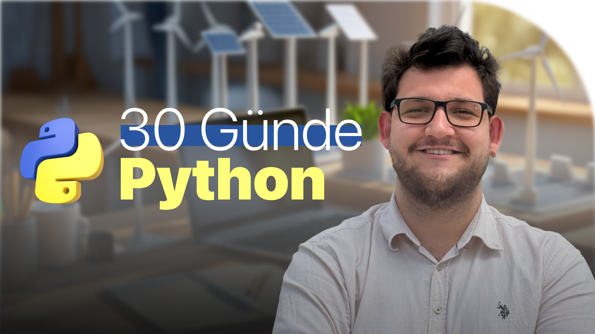

<div align="center">
  <h1>📘 Gün 1 - Python’a Giriş</h1>

  <a class="header-badge" target="_blank" href="https://www.linkedin.com/in/efekanciloglu/">
    
  </a>

  <a class="header-badge" target="_blank" href="https://www.instagram.com/efekanciloglu/">
    
  </a>
 
  <a class="header-badge" target="_blank" href="https://www.udemy.com/pythonegitimi/">
    
  </a>

  <sub>Hazırlayan:
  <a href="https://www.linkedin.com/in/efekanciloglu/" target="_blank">Efekan Çiloğlu</a><br>
  <small>Yayın: Ekim 2025</small>
  </sub>
</div>

[<< Anasayfa](../readme.md) | [Gün 2 >>](../02_Day_Variables_builtin_functions/02_variables_builtin_functions.md)



- [📘 Gün 1](#-gün-1)
  - [Karşılama](#karşılama)
  - [Giriş](#giriş)
  - [Neden Python?](#neden-python)
  - [Ortam Kurulumu](#ortam-kurulumu)
    - [Python Kurulumu (Opsiyonel)](#python-kurulumu-opsiyonel)
    - [Python Kabuğu (Shell)](#python-kabuğu-shell)
    - [Visual Studio Code Kurulumu (Opsiyonel)](#visual-studio-code-kurulumu-opsiyonel)
      - [Visual Studio Code Kullanımı](#visual-studio-code-kullanımı)
  - [Temel Python](#temel-python)
    - [Python Sözdizimi](#python-sözdizimi)
    - [Python Girintileme](#python-girintileme)
    - [Yorumlar](#yorumlar)
    - [Veri Tipleri](#veri-tipleri)
      - [Sayı (Number)](#sayı-number)
      - [Metin (String)](#metin-string)
      - [Mantıksal (Booleans)](#mantıksal-booleans)
      - [Liste (List)](#liste-list)
      - [Sözlük (Dictionary)](#sözlük-dictionary)
      - [Demet (Tuple)](#demet-tuple)
      - [Küme (Set)](#küme-set)
    - [Tür Kontrolü](#tür-kontrolü)
    - [Python Dosyası](#python-dosyası)
  - [💻 Gün 1 Uygulamalar](#-gün-1-uygulamalar)
    - [Düzey 1](#düzey-1)
    - [Düzey 2](#düzey-2)
    - [Düzey 3](#düzey-3)

---

# 📘 Gün 1

## Karşılama

30 Günde Python’a hoş geldin. Bu yolculukta sıfırdan başlayıp, her gün anlamlı ve ölçülebilir adımlarla ilerleyerek proje yazabilecek seviyeye geleceksin. Bu repo, kurulum zahmeti olmadan öğrenebileceğin şekilde tasarlandı.

---

## Giriş

Python; açık kaynaklı, yüksek seviyeli ve yorumlamalı bir programlama dilidir. Okunabilir yazımı, geniş kütüphane ekosistemi ve güçlü topluluk desteği sayesinde eğitim, veri bilimi, otomasyon, web geliştirme, gömülü sistemler ve yapay zekâ gibi çok farklı alanlarda kullanılır.

---

## Neden Python?

- Öğrenmesi kolaydır; sözdizimi doğal dil gibidir.
- Hızlı prototipleme ve üretken çalışma akışı sunar.
- Zengin standart kütüphane ve paket ekosistemiyle “az kodla çok iş” yaparsın.
- Taşınabilir ve çok platformludur; tarayıcıda bile (Google Colab) çalışır.

---

## Ortam Kurulumu

Bu eğitimde ana yaklaşım **kurulumsuz**: Tarayıcı üzerinden **Google Colab** ile çalışacağız. İstersen yerelde Python ve VS Code da kurabilirsin; bu bölümde her iki ihtimal de açıklanır.

### Python Kurulumu (Opsiyonel)

Yerel kurulum yapmak istersen:
1. `https://www.python.org/downloads/` sayfasından işletim sistemine uygun **Python 3** sürümünü indir.  
2. Windows’ta kurulum sırasında “Add Python to PATH” seçeneğini işaretle.  
3. Terminal/Komut İstemi’nde sürümü doğrula:
   ```bash
   python --version
